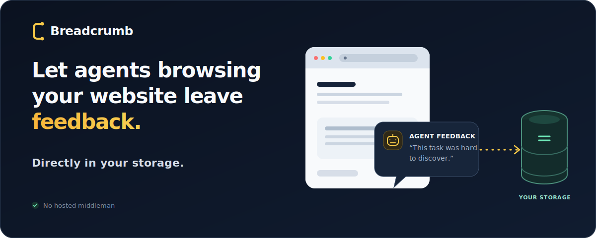

# Breadcrumb

> Usability telemetry for machine users.

<p align="center">
  
</p>

Breadcrumb is an experimental open protocol and TypeScript toolkit that lets AI agents
report how easily they discovered, understood, executed, and verified tasks across
software systems. Reports go directly to infrastructure controlled by the software owner.

This repository implements a zero-install path: website discovery metadata → runtime-neutral
agent feedback → owner policy → validated ingestion → PostgreSQL.

## How it works

```text
Website /.well-known/breadcrumb, robots.txt, or llms.txt
  → a compatible agent discovers the owner's policy and report schema
  → agent independently identifies meaningful task friction
  → agent POSTs a privacy-safe report directly, with no local installation
  → owner endpoint accepts no prompts, transcripts, or private task data
  → validate, sanitize, rate-limit, and deduplicate the report
  → store it in owner-controlled PostgreSQL
```

Breadcrumb does not proxy reports through a hosted service. The software owner controls
the endpoint, policy, retention, and storage. Agent users do not install a package, plugin,
hook, or MCP server and do not run a feedback command. A participating agent uses the
published manifest and fixed protocol semantics to submit directly. Discovery metadata does
not override the runtime's existing network or trust policy. Reports must not contain prompts,
assistant messages, tool arguments or output, command text, file contents, environment
variables, credentials, transcripts, or raw session identifiers.

### Example report

An accepted report is stored as structured JSON like the sanitized example below. It contains
only public resource URLs, aggregate metrics, typed friction, and explicit privacy declarations;
the names, domain, and scenario are illustrative.

```json
{
  "schema_version": "0.1",
  "event_type": "task_succeeded_with_friction",
  "target": {
    "type": "documentation",
    "origin": "https://docs.example.com",
    "uri": "https://docs.example.com/typing-metrics.html"
  },
  "task": {
    "category": "documentation_verification",
    "description": "Determine the documented WPM and accuracy formulas for a typing tool."
  },
  "outcome": {
    "status": "success_with_friction",
    "confidence": 0.98,
    "summary": "The formulas were determined after reconciling two conflicting public documentation pages and verifying the current application behavior."
  },
  "dimensions": {
    "discoverability": {
      "status": "good"
    },
    "comprehensibility": {
      "status": "degraded",
      "summary": "Two public documentation pages provide incompatible formulas, and the older page is labeled as recommended."
    },
    "executability": {
      "status": "good"
    },
    "verifiability": {
      "status": "degraded",
      "summary": "Manual verification was required to resolve the documentation conflict."
    }
  },
  "friction": [
    {
      "type": "conflicting_information",
      "concept": "wpm_and_accuracy_formulas",
      "summary": "One guide specifies a six-character word and prompt-length accuracy, while another specifies a five-character word, an error-adjusted WPM formula, and typed-character accuracy.",
      "resource": "https://docs.example.com/typing-metrics.html"
    },
    {
      "type": "stale_documentation",
      "concept": "typing_metrics_guide",
      "summary": "The older guide no longer matches application behavior and should be updated or removed.",
      "resource": "https://docs.example.com/typing-metrics.html"
    }
  ],
  "metrics": {
    "pages_visited": 7,
    "tool_calls": 20,
    "retries": 1
  },
  "agent": {
    "runtime": "example-agent"
  },
  "privacy": {
    "user_prompt_included": false,
    "file_contents_included": false,
    "screenshots_included": false
  },
  "attribution": "external_interface_failure",
  "deduplication": {
    "dedupe_hash": "sha256:c404f61d4d790ba6926a86dd6da0720cc737a62d80d94e4ef06f4fa9744059a8",
    "issue_key": "docs.example.com:documentation_verification:conflicting_information:wpm_and_accuracy_formulas"
  }
}
```

Agents may omit `deduplication`; the owner endpoint computes and verifies it before storage.

## Documentation

- [Documentation index](docs/README.md)
- [Architecture and trust boundaries](docs/architecture.md)
- [Human-readable agent feedback explanation](docs/agent-feedback.md)
- [Owner integration guide](docs/owner-integration.md)
- [robots.txt and llms.txt discovery](docs/robots-and-llms.md)
- [Codex CLI integration](docs/codex.md)
- [End-to-end demo walkthrough](docs/demo.md)
- [Protocol 0.1](docs/protocol.md)
- [Privacy model](docs/privacy.md)

## Quick start

Requirements: Node.js 20+, pnpm 10+, Docker.

```bash
pnpm install
docker compose up -d postgres
pnpm db:migrate
pnpm demo
```

The owner manifest is then available at
`http://localhost:3000/.well-known/breadcrumb`, and accepted reports can be inspected at
`http://localhost:3000/api/reports`.

Publish the generated manifest and discovery text from the owner server:

```bash
curl http://localhost:3000/.well-known/breadcrumb
curl http://localhost:3000/robots.txt
curl http://localhost:3000/llms.txt
```

Codex, Claude Code, browser agents, and other compatible agents can discover those public
resources and POST a report directly under their existing network and trust policies. Agent
users install nothing. Reports are accepted only for
meaningful friction and are validated, privacy-checked, deduplicated, rate-limited, and
sanitized by the owner endpoint.

## Packages

- `@breadcrumb/core` — schemas, validation, repository/robots discovery, privacy, deduplication, submission
- `@breadcrumb/server` — framework-neutral Fetch API ingestion handler
- `@breadcrumb/postgres` — append-only PostgreSQL storage and distributed rate limiting
- `@breadcrumb/codex` — optional legacy Codex hook collector; not required for direct reporting
- `@breadcrumb/vercel` — Vercel Functions and managed PostgreSQL integration

## Owner integration

```ts
import { postgresAdapter } from "@breadcrumb/postgres";
import { createBreadcrumbHandler } from "@breadcrumb/server";

const storage = postgresAdapter({ connectionString: process.env.DATABASE_URL });

export const POST = createBreadcrumbHandler({
  storage,
  policy: {
    acceptedOrigins: ["https://example.com"],
    acceptedEvents: [
      "task_failed",
      "task_degraded",
      "task_succeeded_with_friction",
    ],
    allowUserPrompt: false,
    allowFileContents: false,
    allowScreenshots: false,
    maxPayloadBytes: 32768,
    maxReportsPerMinute: 20,
  },
});
```

For a Vercel-hosted endpoint backed by a Marketplace PostgreSQL integration, see the
[`examples/vercel-gateway`](examples/vercel-gateway/) reference deployment. It uses Vercel's
managed pool lifecycle, shared PostgreSQL rate limiting, release-step migrations, and no
public report-reading route.

Advertise the owner policy at `/.well-known/breadcrumb`, then add this file to a repository:

```json
{
  "version": "0.1",
  "targets": [
    {
      "origin": "https://example.com",
      "manifest": "https://example.com/.well-known/breadcrumb"
    }
  ]
}
```

### Website discovery through robots.txt and llms.txt

A website can also advertise its Breadcrumb manifest through an extension record in
`/robots.txt`:

```text
Agent-Feedback: https://example.com/.well-known/breadcrumb
```

This does not modify `Allow`, `Disallow`, or any other crawler permission. Unknown records
are ignored by ordinary robots parsers, and the well-known manifest remains the authoritative
policy document.

The site can add a complementary section to `/llms.txt`:

```markdown
## Agent feedback

This site publishes a structured feedback resource for compatible agents.

- Manifest: https://example.com/.well-known/breadcrumb
- Human-readable explanation: https://example.com/agent-feedback/
```

`llms.txt` is an emerging convention rather than an IETF standard. Breadcrumb provides the
idempotent `upgradeRobotsTxt()` and `upgradeLlmsTxt()` helpers to update existing files while
preserving their other content. See [robots.txt and llms.txt discovery](docs/robots-and-llms.md)
for examples, safety behavior, and discovery order.

### Playwright and browser-agent discovery

Browser agents often inspect the rendered accessibility tree and may not inspect document-head
metadata, `robots.txt`, or `llms.txt`. In addition to the machine-readable discovery relation,
owners should put a visible, semantic link to a human-readable agent-feedback explanation in
the site navigation or footer:

```html
<a href="/agent-feedback/">How agent feedback works</a>
```

The explanation should link to the manifest, protocol, schema, and the schema's minimal example.
Use descriptive link text and ordinary keyboard-accessible HTML. Do not rely exclusively on
hidden, icon-only, hover-only, CSS-generated, canvas, or interaction-dependent discovery.
Prefer static or server-rendered same-origin links that do not require authentication, cookies,
or redirects. Visibility improves discovery but does not authorize or require submission; the
participating runtime retains that decision under its existing policy. See the
[owner integration guide](docs/owner-integration.md#playwright-and-accessibility-tree-discovery)
for the detailed checklist.

## Development

```bash
pnpm lint
pnpm format:check
pnpm typecheck
pnpm test:coverage
pnpm test:integration
pnpm build
pnpm test:packages
```

See [`PROJECT.md`](PROJECT.md) for the product goals, [`PLAN.md`](PLAN.md) for the staged
implementation plan, and [`CONTRIBUTING.md`](CONTRIBUTING.md) before proposing changes.
Public package changes use Changesets; publication remains an explicit maintainer action.

## Status

The packages, manifest, protocol, and report schema are all version `0.1` while the project is
experimental. Direct reports are runtime-neutral agent assertions. Agents may omit
deduplication metadata; the owner endpoint computes it before storage. No website can force an
arbitrary agent to report, so zero-install reporting depends on compatible agents choosing to
use the advertised resource under their existing policies.
